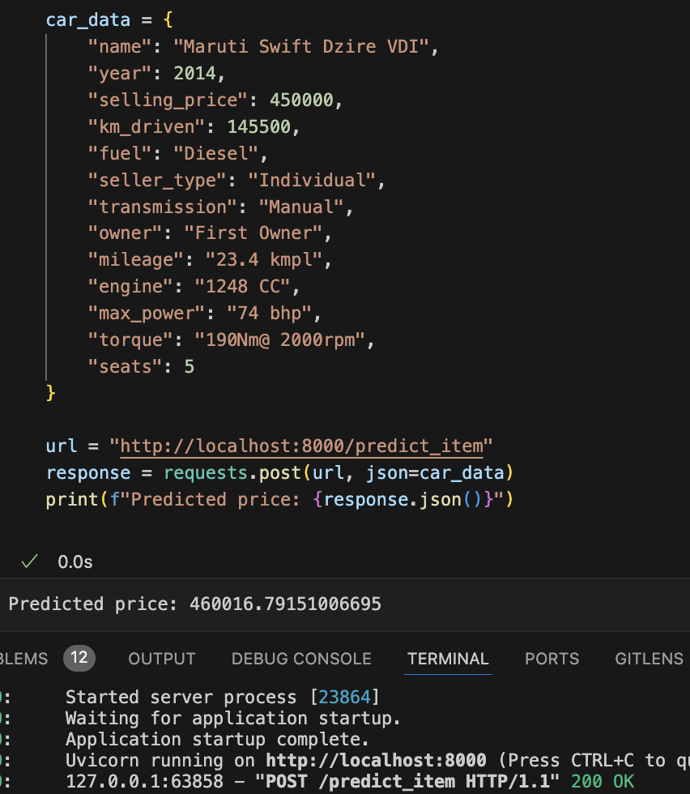
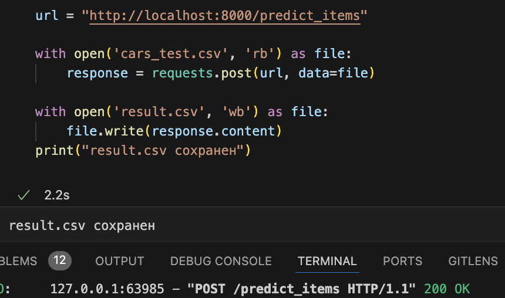
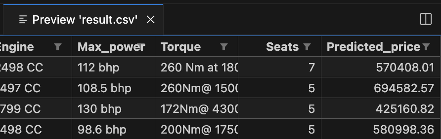

# **Часть 1 | EDA и визуализация**

### 1. Проверил есть ли в датасетах пропуски и удалил их:
```
if sum := df_train.duplicated().sum():
    print(f'Количество дубликатов в df_train = {sum}')
    df_train = df_train.drop_duplicates()

if sum := df_test.duplicated().sum():
    print(f'Количество дубликатов в df_test = {sum}')
    df_test = df_test.drop_duplicates()
```

### 2. Увидел, что в датасетах присутствуют данные, которые межно привести к числам:
- Столбец **engine** привел числу убрав буквы CC в конце строки.
- Столбец **mileage** привел к числу в измерении kmpl (самое частое), исходя из формулы fuel_density * km/kg.
- Столбец **max_power** привел числу убрав буквы bhp в конце строки.

### 3. Заполнил пропуски медианными данными в numeric столбцах:
```
if sum := df_train.isnull().values.sum():
    numeric_columns = df_train.select_dtypes(include=['number']).columns
    df_train[numeric_columns] = df_train[numeric_columns].fillna(df_train[numeric_columns].median())

if sum := df_test.isnull().values.sum():
    numeric_columns = df_test.select_dtypes(include=['number']).columns
    df_test[numeric_columns] = df_test[numeric_columns].fillna(df_test[numeric_columns].median())
```
### 4. Визуализация (pairplot, корреляционная модель)
#### Построил pairplot по трейн выборке, сделал вывод:
- На основании распределения можно сделать предположение, что признаки max_power, year, engine и km_driven имеют связь с целевой переменной. На графиках видно, что распределения имеют зависимости в основном от этих признаков. Соответственно можно судить и о корреляции их с целевой переменной.
- Также исходя из анализа тест выборке: Сококупности оказались похожими, но не идентичными (ожидаемо). При это связь признаков с целевой переменной схожа с данными из трейн выборки.
#### Далее была построена корреляционная модель, из которой выводы:
- Наиболее скорелированны: selling_price и max_power.
- Наиболее сильная зависимость между: max_power, year, engine и km_driven.
- Опираясь на данные можно утверждать, что чем меньше год, тем, скорее всего, больше километров проехала машина к дате продажи, обратив внимание на корреляцию year и km_driven. Она отрицательная. +Если смотреть на pairplot видна зависимость

# **Часть 2 | Модель только на вещественных признаках**

### 1. Разделил выборки на таргет и признаки:
```
num_df_train = df_train.select_dtypes(include='number')
y_train = num_df_train['selling_price']
X_train = num_df_train.drop(columns=['selling_price'])

num_df_test = df_test.select_dtypes(include='number')
y_test = num_df_test['selling_price']
X_test = num_df_test.drop(columns=['selling_price'])
```
### 2. Обучил модель через LinearRegression:
```
model = LinearRegression()
model.fit(X_train, y_train)
y_train_pred_lr = model.predict(X_train)
y_test_pred_lr = model.predict(X_test)
```
Результаты обучения:
```
R^2 train: 0.591540
MSE train: 117080394377
R^2 test: 0.615684
MSE test: 136705424838
```
Модель показывает хорошее качество (59%-62% процентов предсказания) на тестовых и тренировочных данных, есть небольшая разница между R^2 и MSE на тренировочной и тестовой выборках, возможно из-за небольшого переобучения.

### 2. Применил тандартизацию признаков StandardScaler:
```
scaler = StandardScaler()
X_train_scaled = scaler.fit_transform(X_train)
X_test_scaled = scaler.transform(X_test)
```
Результат предсказания модели особо не улучшился :0
Наиболее информативный признак в предсказании цены: max_power 320535

### 3. Обучил модель через Lasso:
```
lasso_model = Lasso()
lasso_model.fit(X_train_scaled, y_train)
y_train_pred_scaled_lasso = lasso_model.predict(X_train_scaled)
y_test_pred_scaled_lasso = lasso_model.predict(X_test_scaled)
```
```
R^2 train: 0.591540
MSE train: 117080394386
R^2 test: 0.615684
MSE test: 136705595228
```
Наиболее информативный признак в предсказании цены: max_power 320536
- L1-регуляризация с параметрами по умолчанию не занулила никакие веса, скорее всего это связано с недостаточной силой регуляризации.

### 4. Обучил модель через GridSearchCV + Lasso:
```
param_grid = {'alpha': [0.01, 1, 10, 100, 1000, 10000, 25000, 50000, 100000]}

lasso_model = Lasso()
grid_search = GridSearchCV(lasso_model, param_grid, cv=10, scoring='neg_mean_squared_error') #r2, neg_mean_squared_error
grid_search.fit(X_train_scaled, y_train)

lasso_model = grid_search.best_estimator_
y_train_pred_scaled_lasso = lasso_model.predict(X_train_scaled)
y_test_pred_scaled_lasso = lasso_model.predict(X_test_scaled)
```
```
R^2 train: 0.591507
MSE train: 117089792756
R^2 test: 0.615179
MSE test: 136884983667
```
Наиболее информативный признак в предсказании цены: max_power 321489
- Количество обученных моделей: 90
- Лучшие параметры: {'alpha': 1000}
- Лучший результат MSE: 121343634680

Лучший КФ у max_power, если выбирать скорринг r2, то зануляются mileage, engine и seats - но результат хуже.

### 4. Обучил модель через ElasticNet + GridSearchCV:
```
param_grid = {'alpha': [0.001, 0.01, 0.5, 1, 10, 100, 1000, 10000, 25000, 50000, 100000],
              'l1_ratio': [0.001, 0.1, 0.2, 0.3, 0.4, 0.5, 0.6, 0.7, 0.8, 0.9, 1]}

elastic_net_model = ElasticNet()
grid_search = GridSearchCV(elastic_net_model, param_grid, cv=10, scoring='neg_mean_squared_error') #r2, neg_mean_squared_error
grid_search.fit(X_train_scaled, y_train)

elastic_model = grid_search.best_estimator_
y_train_pred_scaled_elastic = elastic_model.predict(X_train_scaled)
y_test_pred_scaled_elastic = elastic_model.predict(X_test_scaled)
```
```
R^2 train: 0.591486
MSE train: 117095706582
R^2 test: 0.614691
MSE test: 137058656262
```
Наиболее информативный признак в предсказании цены: max_power 315354
- Количество обученных моделей: 1210
- Лучшие параметры: {'alpha': 0.01, 'l1_ratio': 0.001}
- Лучший результат MSE: 121338155984

Я сделал предсказание с перебором l1_ratio и без, и заметил, что best_score_ в теории может быть лучше, если указывать l1_ratio (баланс между лассо и ридж) - но не во всех случаях. В моем случае результат лучше если оставить только дефолтный 0.5.

# **Часть 3| Добавляем категориальные фичи**
### 1. Предобработал столбец **name**:
```
df_train['name'] = df_train['name'].str.split().str[0]
df_test['name'] = df_test['name'].str.split().str[0]
```
Оставил только марки автомобилей.

### 2. Закодировал категориалльные фичи и ``seats`` методом OneHot-кодирования и заново обучил модель.
```
encoder.fit(df_train[object_features])
X_train_encoded = encoder.transform(df_train[object_features])
X_test_encoded = encoder.transform(df_test[object_features])
```
#### Обучения модели с закодированными категориалльными признаками:
```
param_grid = {'alpha': [0.001, 0.01, 0.5, 1, 10, 100, 1000, 10000, 25000, 50000, 100000]}

elastic_net_model = ElasticNet()
grid_search = GridSearchCV(elastic_net_model, param_grid, cv=10, scoring='neg_mean_squared_error')
grid_search.fit(X_train_scaled_decoded, y_train)

elastic_model = grid_search.best_estimator_
y_train_pred_scaled_elastic = elastic_model.predict(X_train_scaled_decoded)
y_test_pred_scaled_elastic = elastic_model.predict(X_test_scaled_decoded)
```
```
R^2 train: 0.763282
MSE train: 67852509979
R^2 test: 0.762774
MSE test: 84384075027
```
- Количество обученных моделей: 110
- Лучшие параметры: {'alpha': 0.001}
- Лучший результат MSE: 81410661706

Результаты в разы улучшились после добавления закодированных категориалльных признаков в обучение модели.

### 3. Обучил модель через Ridge + GridSearchCV:
```
param_grid = {'alpha': [0.001, 0.01, 0.5, 1, 10, 100, 1000, 10000, 25000, 50000, 100000]}

ridge_net_model = Ridge()
grid_search = GridSearchCV(ridge_net_model, param_grid, cv=10, scoring='r2') #r2, neg_mean_squared_error
grid_search.fit(X_train_scaled_decoded, y_train)

ridge_model = grid_search.best_estimator_
y_train_pred_scaled_ridge = ridge_model.predict(X_train_scaled_decoded)
y_test_pred_scaled_ridge = ridge_model.predict(X_test_scaled_decoded)
```
```
R^2 train: 0.770859
MSE train: 65680475843
R^2 test: 0.765719
MSE test: 83336258909
```
- Количество обученных моделей: 110
- Лучшие параметры: {'alpha': 1}
- Лучший результат R^2: 0.7105812310740294

Модель немного стала лучше :0

# **Часть 4. | Бизнесовая**

### 1. Реализовал бизнесовую метрику:
```
def business_metric(y_true, y_pred):
    correct = (abs(y_true - y_pred) / y_true <= 0.1).sum()
    return correct / len(y_true)
```

### 2. Обучил модель скорингом на бизнес метрку + Pipeline (mymodel):
```
pipeline = Pipeline([
    ('poly', PolynomialFeatures(degree=2, include_bias=False)),
    # ('scaler', StandardScaler()), он не нужен. данные уже скейлил
    ('ridge', Ridge())
])

param_grid = {'ridge__alpha': [0.001, 0.01, 0.1, 1, 10, 100, 1000],
              'poly__degree': [1, 2, 3]} 

scorer = make_scorer(business_metric, greater_is_better=True)
my_model = GridSearchCV(pipeline, param_grid, cv=10, scoring=scorer)
my_model.fit(X_train_scaled_decoded, y_train)

best_model = my_model.best_estimator_
y_train_pred_scaled_mymodel = best_model.predict(X_train_scaled_decoded)
y_test_pred_scaled_mymodel = best_model.predict(X_test_scaled_decoded)
```
```
R^2 train: 0.965711
MSE train: 9828650520
R^2 test: 0.945674
MSE test: 19324350910
```
Результаты бомбические :00
### 3. Посчитал метрику для всех обученных моделей:
```
Train metric lr: 0.2098
Train metric lasso: 0.2099
Train metric elastic: 0.2678
Train metric ridge: 0.2735
Train metric my model: 0.4396
```
```
Test metric lr: 0.2281
Test metric lasso: 0.2260
Test metric elastic: 0.3145
Test metric ridge: 0.3124
Train metric my model: 0.4396
```
**Вывод**:
- Лучше всего на бизнесовой метрике себя показывают модели: elastic и ridge. Они предсказывают в среднем на 10% лучше чем другие модели, возможно, благодаря использованию регуляризации, которая помогает избежать переобучения.
- +надо понимать что elastic и ridge были обучены с onehot категориальными признаками, а lr и lasso нет. Что точно повлияло на результаты бизнес-метрики
- Также обучил свою модель, она показывает результаты в разы лучше. В ней использовал пайплайн и PolynomialFeatures + скоринг выбрал бизнес метрику.

# **Часть 5 (3 балла) | Реализация сервиса на FastAPI**

### 1. Сохранил в pickle модель ridge, onehot и scaler:
```
with open('model_preprocessors.pickle', 'wb') as file:
    pickle.dump({
        'model': ridge_model,
        'encoder': encoder,
        'scaler': scaler
    }, file)
```
### 2. Реализовал метод /predict_item.
#### Демонстрация работы метода /predict_item.
На вход в формате json подаются признаки одного объекта, на выходе сервис выдает предсказанную стоимость машины

На данном объекте можно заметить, что selling_price практически совпадает с предсказанной стоимостью, это говорит о том - что модель неплоха.

#### Разберем работу метода /predict_item.
* Метод принимает json и валидирует его на class Item, в котором описаны ожидаемые на вход типы данных.
* Далее я написал функции предобработки данных, которая приводит данные к формату, которые мы использовали при обучении/тестировании моделей.
* Приводит признак к числам (которые должны быть), скейлим и кодируем признаки скелом и onehot сохраненными в pickle. Следует делать так, потому что scaler и onehot были fit на train выборке при обучении. Это позволит привести данные к общему формату.
* Предсказываю цену, используя модель сохраненную в piclke.


### 2. Реализовал метод /predict_items.
#### Демонстрация работы метода /predict_items.
- На вход в примере подается scv тестовая выбору из задания (сырая).


- Метод возвращает scv файл добавляя +1 столбец с предсказанной стоимостью.


#### Разберем работу метода /predict_items.
* Метод принимает scv и записывает каждую строку файла в список словарей (каждая строка является словарем).
* Далее идем циклом по списку словарей и обращаемся к уже существующему методу **predict_item**, в нем обрабатываются сырые данные и возвращается предасказанная цена. Записываем ему к каждому словарю.
* Преобразуем список словарей в scv и возвращаем scv файл с +1 столбцом предсказанной ценой.

# **Вывод**:
- Множество моделей обучены на ridge, lasso, lr, elastic. Среди них самыми оптимальными в предсказании цены оказались ridge и elastic. Модель ridge была выбрана для дальнейших эксперементов с API.
- Также была реализована бизнес-метрика, которая показывает качество обученных моделей на реальной задаче бизнеса, что помогло в определении цели обучения моделей.
- После был реализован сервис API, с помощью которого появилась возможность прогнозировать цену на автомобиле имея новые данные в один запрос.


